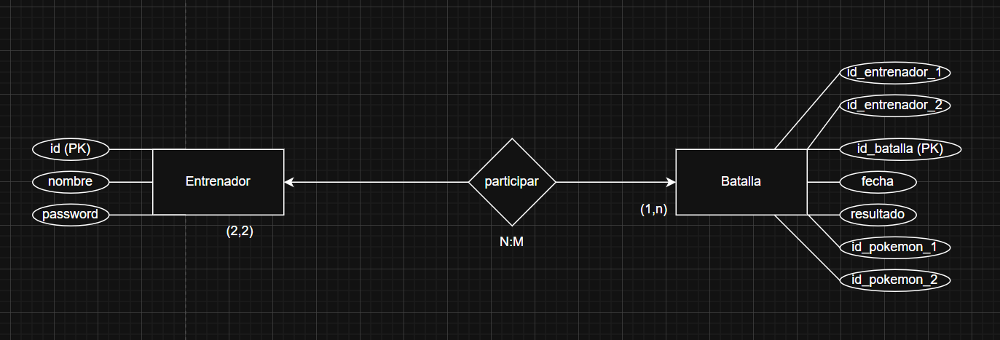
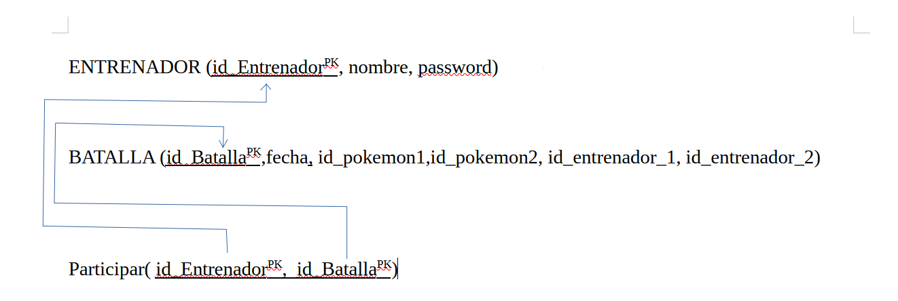

# pokemon_sonimu

## Integrantes del equipo

#### Marcos Fernandez Garcia
#### Alan Novas Mateo

## Descripcición
Proyecto dedicado a las batallas pokemon utillizando lenguajes como Python, HTML y CSS

## Instalacion de flask

.\.venv\Scripts\pip.exe  install pytest

0. Ejecuta un script con la instalación 

Con este comando habilitas la instalacion, por defecto windows no permite ejecutar scripts
(Este comando solo se necesita ejecutar una vez):
`Set-ExecutionPolicy -Scope CurrentUser RemoteSigned`

Con esto ejecutas el Script
.\setup.ps1

1. utilizar el siguiente comando en la terminal de visual como en una terminal independiente:

        1.1 Instalacion del venv

    python -m venv nombreDelArchivo

    ``
    python -m venv .venv
    ``
    
2. Instalar flask buscando las carpetas dentro del .venv, ejemplo:

        ./.venv/Script/pip.exe install flask

Con este comando instalarás el flask.

Revisa las versiones que tienes que sean iguales al archivo ``requirements.txt``

    ./.venv/Script/pip.exe freeze 

Para ver las versiones que tienes.

pip install -r requirements.txt

3. Para ejecutar el proyecto python -m app.main

## Fase 0 ✅
El proyecto tiene la siguiente estructura:

    mi_proyecto/
    ├─ app.py
    ├─ templates/
    │   └─ index.html
    └─ static/
        ├─ css/
        │ └─ estilo.css
        ├─ js/
        │ └─ app.js
        └─ img/
        └─ logo.png
    └─ data/
        └─ pokemon.json

El fichero `requiements.txt` tiene las versiones de flask que se utilizaran en este proyecto

## Fase 1 ✅

### Pagina inicial ✅

### Listado de Pokemon ✅

    Creacion de un for donde se recorre cada tipo de pokemones, se añade una imagen dependiendo del tipo de pokemon que sea
    es decir si es tipo fuego tendra una imagen fire.png y asi sucesivamente.

        
            
            
        <h2>{{poke.name}}</h2>

### PokemonID (Datalles)

A parte del tipo de pokemon presentamos con mas detalles la altura su peso que se a considerado que si un pokemon pesa mas de
100 es ligero si es mayor que 500 es pesado y por ultimo si pesa menos de 100 es normal.

            <h2>{{pokemon.name}}</h2>
            <!-- Tipos -->
            
                
            

            <!-- Altura -->
            
Altura: {{ pokemon.height }}0 cm 

            <!-- Pesos -->
            
                
Peso: ligero

            
                
Peso: pesado

            
                
Peso: normal

            

## Fase 2 ✅

Pagina princpal con formulario ✅

Listado de Pokémon (/pokemons) ✅

Página de batalla (/battle) ✅

## Comando para crear las tablas necesarias para el funcionamiento de la base de datos pokemons.db

`flask.exe --app app.main crear_tablas`

Recordar que este comando se ejecutará a nivel de la carpeta donde se encuentra el proyecto.

## Fase 5 ✅

### Modelo EER de la base de datos del proyecto

### Modelo Relacional

En esta fase creamos la base de datos `pokemons.db` y `entrenador_Repo.py`, dentro de la base de datos tenemos una tabla **entrenador** que creamos desde el modelo `trainer.py`

### trainer.py
En este script se crean la tabla entrenador para la base de datos pokemons.db, tiene un constructor donde resive su nombre y contraseña mas el id que por defecto es **None** ya que este en la base de datos será autoincremental.

tiene funciones de seguridad para la contraseña de la libreria `werkzeug.security` donde se importan dos funciones, una para "hashear" la contraseña y otra para verificar la contraseña que se pasa por parametro comparando en formato hash.

### entrenador_Repo.py
Este script se conecta a la base de datos para acceder a la informacion que contiene esta.

Tiene 3 funciones donde se gestiona e inserta los datos de cada entrenador:

crear_entrenador(nombre, password): Esta funcion crea (como su nombre lo indica) un entreandor con su nombre y contraseña donde al final de todo lo guarda en la tabla entrenador en la base de datos recordar que es creada por la clase trainer.py asi que este clase see debe importar a este script.

obtener_entrenador_por_nombre(nombre): Accede a la base de datos y hace una consulta para obtener por nombre un entrenador donde se guarda en una variable donde esta si no tiene nada es decir si es None retorna None en caso contrario retorna el entrenador obtenido.

obtener_todos_los_entrenadores(): Retorna una lista de los entrenadores que estan en la base de datos sin "filtros" es decir TODOS.

### trainer_service.py

En este script se ejecutan a mayores lo programado en el script **entrenador_Repo.py** utilizando los metodos: crear_entrenador y  obtener_todos_los_entrenadores para las siguientes funciones:

registrar_entrenador(nombre, password): Esta funcion en primera instancia utilizamops la funcion `obtener_todos_los_entrenadores()`(Recordar que devuelve una lista) en un bucle for donde en un condicional verificamos que el nombre y contraseña sean iguales a las de algunos de los que estan en la lista, si esta resulta verdadera la variable existe retorna True en caso contrario lo crea gracias a la funcion `crear_entrenador(nombre, password)` del script importado.

autenticar_entrenador(nombre, password): Teniendo la misma logica utilizamos la funcion de obtener todos los entrenadores y solo verificamos si la informacion introducida en la funcion es igual a alguno de los nombres y contraseñas establecidos en la base de datos, si es el caso retorna True, en caso contrario False.

# Fase 6
### Fase de Implementación del Sistema de Batallas Persistentes
app
    ├─ models/
    │   └─ trainers.py

Dentro de la capa modelos se crea una clase llamada servidor que recibirá en su constructor su nombre, contraseña e id que por defecto será None.

En esta misma a mayores tiene funciones como `set_password(self, newPassword)` y `verificar_password(self, passwd)` modifican y verifican la contraseña del entrenador o usuario. 

app
    ├─ database/
    │   └─ db.py

Tambien se crea la tabla para la base de datos dentro de la clase `trainer.py` importando la base de datos desde la capa database `db.py` para permitir crear la tabla y las columnas del usuario o entrenador teniendo en cuenta que en la creacion de la tabla esta relacionado con la creacion de la tabla que se encuentra en la clase `batalla_bd.py`.

app
    ├─ models/
    │   └─ batalla_bd.py

En esta clase recaba toda la informacion correspondiente a la batalla para crear la tabla y sus distintas columnas, informacion como el id de la batalla que es autoincremental la fecha en que se creo el id de los entrenadores que se enfrentan, a su vez tambien el id de los pokemons que se enfrentarán y por ultimo el resultado donde si el entrenador a ganado o no la batalla.

#### Repositorio de Batallas

`crear_batalla` Registra una nueva batalla en la base de datos, almacenando los entrenadores participantes, los Pokémon utilizados y el resultado final, por ultimo devuelve la batalla creada tras confirmarse la operación.

`obtener_batalla_por_id` Recupera una batalla concreta a partir de su identificador único. Devuelve None si no existe ninguna batalla con ese ID.

`obtener_batallas_por_entrenador` Obtiene el listado de batallas iniciadas por un entrenador específico, filtrando por su identificador, permite mostrar el historial de batallas del entrenador autenticado.

`eliminar_batalla` Elimina una batalla de la base de datos respetando las reglas de integridad establecidas.
    

# Fase 7
### Integración y Consumo de APIs REST Externas en Flask
app
    ├─ clients/
    │   └─ pokemon_clients.py

Dentro de esta capa se ha creado un cliente específico que realiza peticiones HTTP a la PokeAPI mediante la librería requests, comprueba el estado de las respuestas antes de procesar los datos, sin incluir lógica de negocio, incorpora un sistema básico de caché en memoria con TTL reduciendo llamadas repetidas a la API y mejorando el rendimiento.

La capa de servicios de Pokémon `pokemon_services.py` ha sido adaptada para utilizar exclusivamente este cliente el servicio actúa como único punto de acceso a los datos Pokémon para el resto de la aplicación, se elimina el acceso directo a ficheros JSON, manteniendo la compatibilidad con la lógica existente.

# Fase 8
### Optimización de Rendimiento y Escalabilidad de la Aplicación

app
    ├─ services/
    │   └─ pokemon_services.py

En la funcion `paginacionPokemon` de la clase `pokemon_services.py` se implementa la paginacion del listado de Pokemon en el servidor.

La funcion obtiene los parametros page y limit desde la peticion HTTP lo que permite controlar la pagina actual y el numero de pokemon mostrados por paginas. A partir de estos valores se consulta la PokeAPI y se calcula el numero total de paginas disponibles.

Se determina si existen paginas anteriores o posteriores habilitando o deshabilitando los botones de navegación (Anterior y Siguiente) segun corresponda.

Esta funcion devuelve un diccionario con toda la informacion necesaria para la manipular en el html que seria la pagina actual, total de Pokemon, numero total de paginas y listado de Pokemon.

app
    ├─ clients/
    │   └─ pokemon_clients.py

En la clase `PokemonJsonClient` se ha utilizado la clase `OrderedDict` para implementar un sistema de cache en memoria que permite optimizar el acceso a la PokeAPI.

OrderedDict se usa para almacenar las respuestas obtenidas de la API manteniendo el orden de insercion y uso de los elementos aplicandole un tamaño maximo dentro de la cache, cuando dicho limite se alcanza se elimina automaticamente la entrada mas antigua el limite maximo en cache es de 100 elementos.
