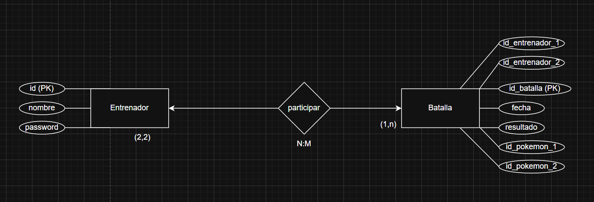
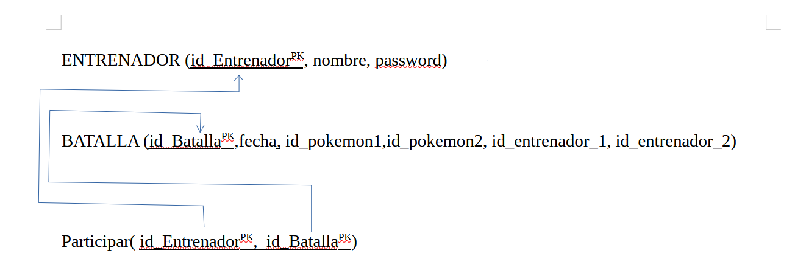

# Pokémon Sonimu

Aplicación web de batallas Pokémon por turnos desarrollada con Flask. Los usuarios se registran como entrenadores, eligen un Pokémon de la Pokédex y combaten contra un rival aleatorio. Los datos de los Pokémon se obtienen en tiempo real de [PokeAPI](https://pokeapi.co/) y el historial de batallas se guarda en una base de datos SQLite.

Proyecto académico desarrollado en equipo.

---

## Funcionalidades

- **Registro e inicio de sesión de entrenadores** con nombre único, contraseñas almacenadas como hash (`werkzeug.security`) y formularios validados con Flask-WTF (protección CSRF incluida).
- **Pokédex paginada** con tipos, estadísticas, altura, peso y sprites animados de cada Pokémon.
- **Sistema de batalla por turnos**:
  - El orden de ataque se decide por la estadística de velocidad.
  - El daño se calcula a partir de la potencia del movimiento, la relación ataque/defensa y la efectividad de tipos (tabla completa de 18 tipos).
  - Cada ataque puede fallar según la precisión del movimiento.
  - Registro de combate turno a turno y un 5 % de probabilidad de que aparezca la variante shiny.
- **Historial de batallas** persistente por entrenador.
- **Página 404 personalizada** para Pokémon inexistentes.

---

## Tecnologías

| Área | Tecnología |
|---|---|
| Lenguaje | Python 3 |
| Framework web | Flask 3.1 |
| ORM | Flask-SQLAlchemy / SQLAlchemy 2.0 |
| Base de datos | SQLite |
| Formularios | Flask-WTF / WTForms |
| Sesiones | Flask-Session (almacenamiento en ficheros) |
| Plantillas | Jinja2, HTML, CSS |
| Cliente HTTP | requests |
| Tests | pytest |
| API externa | [PokeAPI](https://pokeapi.co/) |

---

## Arquitectura

La aplicación sigue una arquitectura por capas con responsabilidades separadas:

```
app/
├── routes/         Blueprints de Flask: reciben la petición y renderizan la vista
├── services/       Lógica de negocio: batalla, entrenadores, adaptación de datos de Pokémon
├── repositories/   Acceso a datos con SQLAlchemy
├── clients/        Cliente HTTP de PokeAPI con caché
├── models/         Modelos de dominio y tablas ORM
├── forms/          Formularios Flask-WTF
├── database/       Instancia de SQLAlchemy
├── templates/      Vistas Jinja2
└── static/         CSS, fuentes e imágenes
```

### Cliente de PokeAPI con caché

`app/clients/pokemon_clients.py` concentra todas las llamadas a PokeAPI. Para reducir peticiones repetidas implementa una **caché LRU en memoria** basada en `OrderedDict`:

- Capacidad máxima de 100 entradas; al llenarse se descarta la usada hace más tiempo.
- Cada entrada caduca pasado un TTL de 1600 segundos.
- Las peticiones tienen timeout y el estado HTTP se valida antes de procesar la respuesta.

### Modelo de datos

| Modelo EER | Modelo relacional |
|---|---|
|  |  |

---

## Instalación

### Requisitos

- Python 3.9 o superior (probado con Python 3.13)
- Conexión a internet (los datos de Pokémon se obtienen de PokeAPI)

### Instalación automática (Windows)

El script `setup.ps1` crea el entorno virtual, instala las dependencias, crea la base de datos y arranca la aplicación:

```powershell
# Solo la primera vez, para permitir la ejecución de scripts locales
Set-ExecutionPolicy -Scope CurrentUser RemoteSigned

.\setup.ps1
```

### Instalación manual

```bash
# 1. Crear y activar el entorno virtual
python -m venv .venv
.venv\Scripts\activate          # Windows
source .venv/bin/activate       # macOS / Linux

# 2. Instalar dependencias
pip install -r requirements.txt

# 3. Crear las tablas de la base de datos (data/pokemons.db)
flask --app app.main crear_tablas

# 4. Arrancar la aplicación
python -m app.main
```

La aplicación queda disponible en `http://localhost:8080`.

El comando `crear_tablas` recrea la base de datos desde cero y añade tres entrenadores de ejemplo (`Paco`, `Alex El Capo` y `Anuel AA`, contraseña `1234`), necesarios para que haya rivales en las batallas.

### Variables de entorno

| Variable | Descripción | Requerida |
|---|---|---|
| `SECRET_KEY` | Clave para firmar las sesiones y los tokens CSRF. Si no se define, se genera una aleatoria en cada arranque y las sesiones abiertas se invalidan al reiniciar. | No (recomendada en producción) |

---

## Tests

```bash
pip install pytest
python -m pytest -v
```

Los tests cubren el cliente de PokeAPI (inserción, límite de capacidad, expulsión LRU y expiración por TTL de la caché) el servicio de listado de Pokémon y el registro de entrenadores (incluido el rechazo de nombres duplicados), con las dependencias externas simuladas mediante `unittest.mock`.

---

## Autores

- **Alan Novas Mateo** — [@Alan3420](https://github.com/Alan3420)
- **Marcos Fernández García** — [@marcosfergar](https://github.com/marcosfergar)
